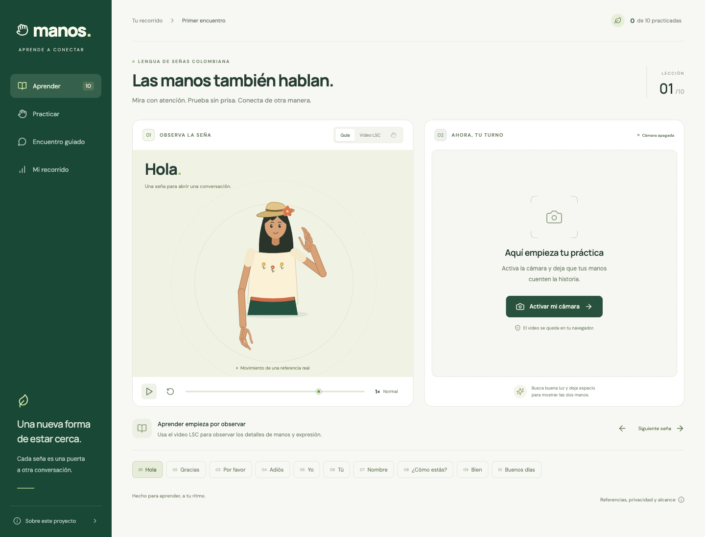

# Manos — Lengua de Señas Colombiana

A local, Spanish-language teaching app with ten authentic LSC references. Observe an animated guide or the original signer, practice on camera, compare movement, retry, and keep a local practice history.

[Project handoff](HANDOFF.md) · [Engineering handoff](docs/engineering-handoff.md) · [Module handoffs](handoffs/README.md) · [Reuse audit](docs/reuse-audit.md)



## Run

Requires Node.js 22.12+ and npm. From this directory:

```sh
npm ci
npm run assets
portless manos sh -c 'npm run dev -- --port "$PORT"'
```

To serve a local production build, run:

```sh
npm run build
portless manos sh -c 'npm run preview -- --port "$PORT"'
```

Open https://manos.localhost. Allow camera access when you press **Activar mi cámara**. Chrome/Edge are the recommended browsers for the local MediaPipe runtime. Audio is not requested.

`npm run build` generates `dist/`; `npm test` runs the evaluator, camera and avatar checks. `npm run verify:assets` verifies bundled files; `npm run verify:fixtures` reproduces diagnostic comparisons. MediaPipe WASM, models, fonts, videos, and reference trajectories are served locally. There is no API key or backend.

## What is included

- Hola, Gracias, Por favor, Adiós, Yo, Tú, Nombre, ¿Cómo estás?, Bien, Buenos días.
- Live character mirror following the camera, plus an animated 2D character driven by recorded body and hand landmarks, with original LSC video beside the same lesson controls.
- Full-resolution video, normal/half-speed playback, pause, replay, keyboard seeking and zoom; camera countdown and bounded/manual recording.
- Learn, memory practice, and a guided sequence of five isolated expressions.
- Camera permission, unavailable-device, loading, failure, stop, and interrupted-attempt handling.
- Local practice history; the last attempt is kept in memory for visual comparison and discarded on lesson change.
- Responsive interface, keyboard controls, source attribution, and explicit evaluation limitations.

## What the analysis changed

The linked conversation proposed a full interactive LSC tutor using SignBridge as a skeleton. Inspection confirmed reusable DTW and MediaPipe asset-loading code. Its ASL/PSL models are not LSC models, and its existing avatar is a procedural hand, not a complete signing character. This app therefore reuses the comparison primitive and local asset loader, adds an LSC data adapter, and builds the learning flow around real LSC data. It does not relabel another language's model or animations.

The initial ten-sign loop is implemented. The longer-term ambition—reliable open conversation with pedagogically validated feedback—still requires LSC teachers, learner trials, multiple signer references, facial/nonmanual modeling, and validated evaluation thresholds. A geometric score is not a sign-language proficiency measurement.

## Evaluation limits

The score is estimated 2D similarity for the requested isolated sign, using hand shape, position relative to the shoulders, and temporal movement. It is not a classifier for arbitrary signing. Facial grammar and calibrated 3D palm orientation are not evaluated. The character's face is stylized; use the original video to observe expressions and details. Regional and personal variants may differ from the single selected recording.

Recordings captured through a fake browser camera during verification are identified as recorded-source tests, not a live human acceptance test. See `VERIFICATION.md` for the final checks and remaining limits.

## Sources and licenses

See `SOURCES.md` and `LICENSE-SignBridge`. Dataset: LSC50, Flórez-Sierra et al. (2024), CC BY 4.0. The shipped videos are compressed derivatives, and the animation data is adapted from the published landmarks. SignBridge code is MIT. Google Fonts licenses are under `public/fonts/`.
